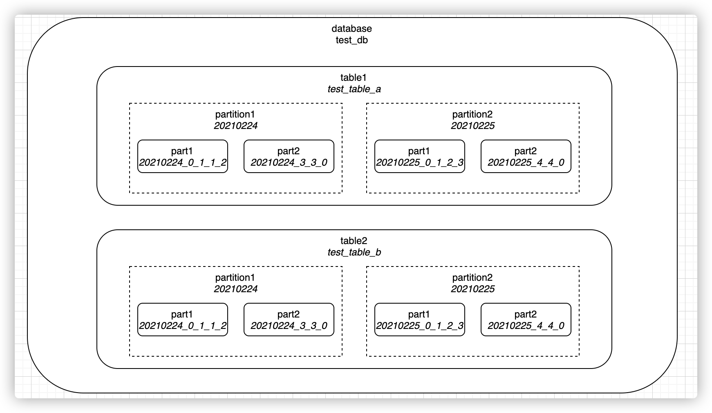
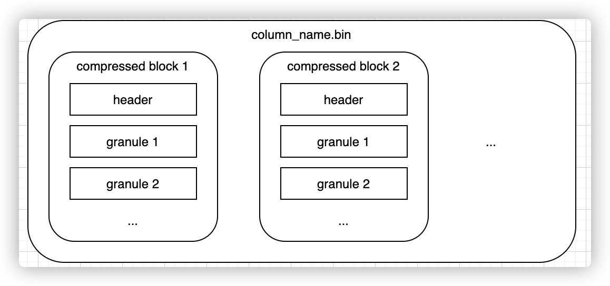
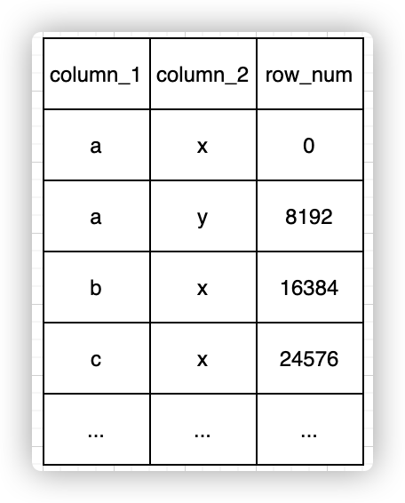
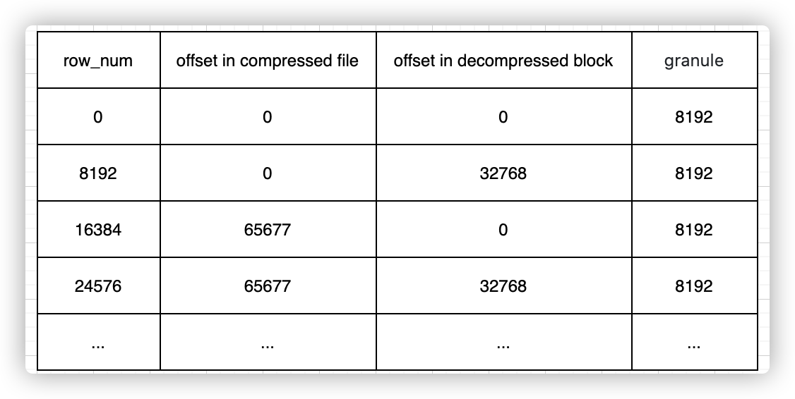
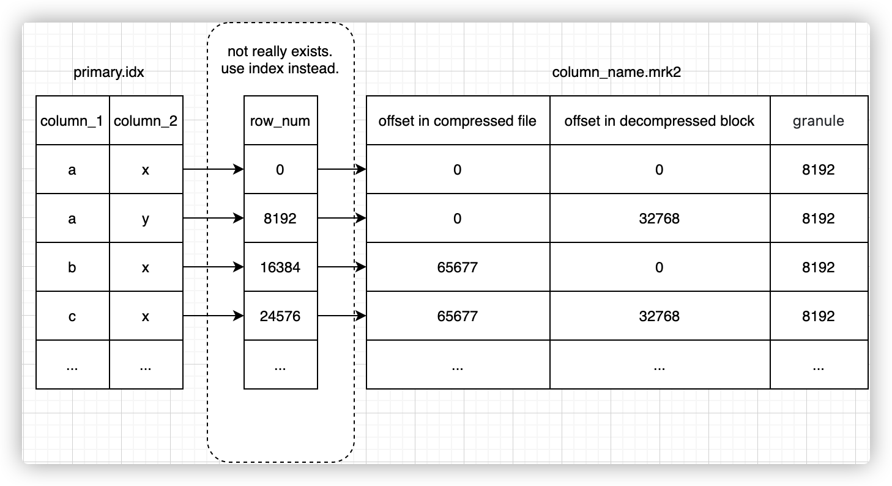

# 1. Clickhouse之存储

Clickhouse是一款列式存储的开源DBMS，以其强悍的单机运算能力著称

Clickhouse中有众多表引擎，不同的表引擎在底层数据存储上千差万别，其中以MergeTree系列使用最为广泛。

MergeTree家族是Clickhouse中最有特色。为了了解这些功能是如何实现的，首先需要知道在MergeTree引擎时，数据文件的组织、存储形式及内容。

# 2. 数据存储格式
## 2.1. 数据存储的目录组成
```
clickhouse
└── test_db
          ├── test_table_a
          │      ├── 20210224_0_1_1_2
          │      ├── 20210224_3_3_0
          │      ├── 20210225_0_1_2_3
          │      └── 20210225_4_4_0
          └── test_table_b
                   ├── 20210224_0_1_1_2
                   ├── 20210224_3_3_0
                   ├── 20210225_0_1_2_3
                   └── 20210225_4_4_0
```


在clickhouse中，一个典型的分区表在文件系统中的目录存储结构如上图所示。

库（database）、表（table）、（）都是按文件目录组织起来的，每个库会有对应的一个库目录，库中的每个表也会有各自对应的表目录。
每张表会包含若干个分区，这里的分区是逻辑概念，并不像库表那样会有目录与之一一对应。

在目录形式上，分区实际是一系列part的集合。每张表至少会有一个分区，如果不进行分区配置，则默认为一个all分区。
每个分区是由若干个part组成的，每个part对应一个目录，一般命名格式为{partition}{min_block_number}{max_block_number}{level}，如果经过mutate操作，则还会有{data_version}的后缀。

在part命名格式{partition}{min_block_number}{max_block_number}{level}_{data_version}中：
 - partition是分区值
 - min_block_number，max_block_number表示这个part包含的最小、最大的block number。每次数据写入都会至少生成一个block，每个block会有自己的block_number
 - level表示这个part经过了几次merge，每merge一次会更新生成一个level+1后的part目录
 - data_version表示mutate操作的data_version，每一次mutate都会生成一个新的data_version的part目录，这个值的含义其实和block_number类似，同时也和block_number共用自增id空间，通过这个值可以判断每个part是否包含在本次mutate操作的影响范围内
 - block_number，level以及mutation在不同的partition中是相互独立的

## 2.2. 数据Part存储
part目录的作用是以一种方式将磁盘的数据组织起来，以支持高效的写入和查询，目录中各个文件的作用是：
 - checksums.txt：当前目录下各个文件的大小以及各文件内容的hash，用于验证数据是否完整
 - columns.txt：此表中所有列以及每列的类型
 - count.txt：此part中数据的行数
 - default_compression_codec.txt：数据文件的默认压缩算法
 - minmax_dt.idx：此表的分区列dt，在这个part中的最大值和最小值
 - partition.dat：从分区列计算出分区值的方法
 - primary.idx：数据索引，其实是排序键的那一列每间隔index_granularity的值，如果有n列，那每间隔index_granularity就会有n个值，同时也会受index_granularity_bytes影响
 - {column_name}.bin：每一列数据的列存文件，存放了实际每一单独列在各行的数值
 - {column_name}.mrk2：每一列数据的列存数据标记

上述文件中，列存文件、数据索引和数据标记是最关键的三类部分，是Clickhouse存储和查询数据的核心基础，下面再进一步详细看看这三类文件的内容和作用。

### 2.2.1. 列存文件
在Part目录下，可以观察到，每一列均有一个单独的列存文件{column_name}.bin来存储实际的数据。

为了尽可能减小数据文件大小，文件需要进行压缩，默认算法由part目录下的default_compression_codec文件确定。

如果直接将整个文件压缩，则查询时必须读取整个文件进行解压，显然如果需要查询的数据集比较小，这样做的开销就会显得特别大，因此一个列存文件是一个个小的压缩数据块组成的。

一个压缩数据块中可以包含若干个granule的数据，而granule就是Clickhouse中最小的查询数据集，后面的索引以及标记也都是围绕granule来实现的。

granule的大小由配置项index_granularity确定，默认8192；压缩数据块大小范围由配置max_compress_block_size和min_compress_block_size共同决定。
每个压缩块中的header部分会存下这个压缩块的压缩前大小和压缩后大小。整个结构如下图所示：



### 2.2.2. 数据索引文件
在Clickhouse中，数据表中最终的数据是按列存储在Part目录下的各自对应的列存文件下的。

那么，查询时应该如何从不同的列存文件中查找到同属于某一行的数据？

有一个前提是，在Clickhouse中，如果使用MergeTree系列的表引擎，则必须指定一个排序键。

排序键可以由一列或多列组成，在数据写入磁盘文件中时，数据行的就会按照制定的顺序排列，随后按列拆分写入各个列存文件中。

在数据有序的前提下，假设文件不进行任何压缩，则可以通过行号以及每个字段自身所占大小推算出某行号据在文件中的位置。

因此，最暴力的方法是根据查询条件到对应列存文件中遍历扫描，查询到对应的数据行号，再由此行号获取其他列存文件在相同行号范围内的数据。

显然，如果能够做一个数据 => 行号的索引，则可以在很大程度上提高查询效率，减少文件遍历扫描，这就是数据索引文件（primary.idx）的作用。

为了尽量减小索引所占的空间，并且实际上列存文件数据也是按granule组织的，因此可以用稀疏索引的方式建立排序键到行号的对应关系，索引间隙的大小和granule相同，则大致的索引结构就可以描述为下图（和实际的primary.idx文件的内容有些许差异，后文会进一步说明，但用下图可以描述需要达成的作用）：



通过上面这样一个索引结构，可以快速查询到指定条件下数据所在行的范围，再通过行号以及各个列的字段长度可以推算出其他列在各自文件中的位置范围。

然而实际上，数据在clickhouse中是经过压缩的，且压缩数据正是clickhouse以及其他列存数据库能够达到高性能的原因，极致的压缩能尽可能减少对磁盘的读取。

在数据压缩的情况下，各个列每行所占的世纪大小与设定的字段长度并不相同，单靠行号已经无法计算出各列在列存文件中的具体位置，而是还需要各个列单独有自己的一个 行号 => 数据位置的关系。

### 2.2.3. 数据标记文件
在Clickhouse中，每一列的数据都经过某种压缩算法进行压缩。

在这种情况下，从数据索引文件查询出数据所在行号后，无法通过行号+字段类型来推算出某行数据的具体位置，为了提高查询性能，Clickhouse设计了数据标记文件，帮助我们更高效地获取到每行数据在列存文件中的具体位置。



上文提到过，列存文件是由一个个压缩数据块组成的，为了查询数据，首先需要定位到数据属于那部分压缩数据块，这里的压缩数据块位置是未解压前的偏移量，找到这个位置后可根据压缩块header中内容将压缩块解压，再通过块内偏移量，就能查到具体的数据。


### 2.2.4. 索引与标记的协同

上文提到，定位一行数据的过程大概是：

 1. 通过索引文件查到对应的行号范围
 2. 通过行号在数据标记文件中查到数据在列存文件中的偏移

索引文件和标记文件实际是一对多的关系（主键只有一个，但列有很多），将索引文件和标记文件剥离后，索引文件大小比较小，可以常驻内存。

查询到数据范围后，可以直接计算出数据对应在标记文件中的位置，做最小化查询。



这里的行号其实只是用于关联起索引和标记两个表，而这两个表的数据在行方向其实是一一顺序对应的，因此行号其实是实际上是不需要存在文件中的，这也是Clickhouse追求极致性能，数据尽量精简的一个体现.

# 3. 二级索引

用户只能在MergeTree表引擎上使用数据跳数索引。每个跳数索引都有四个主要参数：
 - 索引名称。索引名用于在每个分区中创建索引文件。此外，在删除或具体化索引时需要将其作为参数。
 - 索引的表达式。索引表达式用于计算存储在索引中的值集。它可以是列、简单操作符、函数的子集的组合。
 - 类型。索引的类型控制计算，该计算决定是否可以跳过读取和计算每个索引块。
 - GRANULARITY。每个索引块由颗粒（granule）组成。例如，如果主表索引粒度为8192行，GRANULARITY为4，则每个索引“块”将为32768行。

当用户创建数据跳数索引时，表的每个数据部分目录中将有两个额外的文件:
 - skpidx{index_name}.idx：包含排序的表达式值。
 - skpidx{index_name}.mrk2：包含关联数据列文件中的相应偏移量。

# 4. 更新

## 4.1. Partition Operations
这个方法是比较早就提出的解法，大致思路是就是操作分区，有更新就将删掉原分区，然后用新的分区替代。

下面是通过分区进行数据更新的步骤：

 - Create modified partition with updated data on another table
 - Copy data for this partition to detached directory
 - DROP PARTITION in main table
 - ATTACH PARTITION in main table

分区交换对于低频率的批量数据更新比较有用，但当需要实时的高频率的更新数据时，它们就不那么方便了。此外，开发人员操作分区还是不太方便的，因此这种方法一般用的比较少。

## 4.2. Incremental Log

Incremental log的思想是什么了？比如对于用户浏览统计表中的一条数据，如下所示：

```
┌──────────────UserID─┬─PageViews─┬─Duration─┬─Sign─┐ 
│ 4324182021466249494 │         5 │      146 │    1 │ 
└─────────────────────┴───────────┴──────────┴──────┘
```

现在有更新了：用户又浏览了一个页面，所以我们应该改变pageview从5到6，以及持续时间从146到185。那么按照Incremental log的思想，再插入两行:

```
┌──────────────UserID─┬─PageViews─┬─Duration─┬─Sign─┐ 
│ 4324182021466249494 │         5 │      146 │   -1 │ 
│ 4324182021466249494 │         6 │      185 │    1 │ 
└─────────────────────┴───────────┴──────────┴──────┘
```

第一个是删除行。它和我们已经得到的行是一样的只是Sign被设为-1。第二个更新行，所有数据设置为新值。之后我们有三行数据:

```
┌──────────────UserID─┬─PageViews─┬─Duration─┬─Sign─┐ 
│ 4324182021466249494 │         5 │      146 │    1 │ 
│ 4324182021466249494 │         5 │      146 │   -1 │ 
│ 4324182021466249494 │         6 │      185 │    1 │ 
└─────────────────────┴───────────┴──────────┴──────┘
```

那么对于count,sum,avg的计算方法如下：

```
-- number of sessions
count() -> sum(Sign)  
-- total number of pages all users checked 
sum(PageViews) -> sum(Sign * PageViews)  
-- average session duration, how long user usually spent on the website 
avg(Duration) -> sum(Sign * Duration) / sum(Sign)
```

这就是Incremental log方法，这种方法的不足之处在于：

 - 首先需要获取到原数据，那么就需要先查一遍CK，或者将数据保存到其他存储中便于检索查询，然后我们才可以针对原数据插入一条 ‘delete’ rows；
 - Sign operations在某些计算场景并不适合，比如min、max、quantile等其他场景；
 - 额外的写入放大：当每个对象的平均更新次数为个位数时，更适合使用。

## 4.3. Alter/Update Table
更新是一个异步的操作。当用户执行一个如上的Update操作获得返回时，ClickHouse内核其实只做了两件事情：
 1. 检查Update操作是否合法；
 2. 保存Update命令到存储文件中，唤醒一个异步处理merge和mutation的工作线程；

异步线程的工作流程极其复杂，总结其精髓描述如下：先查找到需要update的数据所在datapart，之后对整个datapart做扫描，更新需要变更的数据，然后再将数据重新落盘生成新的datapart，最后用新的datapart做替代并remove掉过期的datapart。

这就是ClickHouse对update指令的执行过程，可以看出，频繁的update指令对于ClickHouse来说将是灾难性的。(当然，我们可以通过设置，将这个异步的过程变成同步的过程，详细请看：Synchronicity of ALTER Queries，然而同步阻塞就会比较严重）。

ClickHouse对Update语句支持的不好，但是对于Insert语句，尤其是批量插入支持的很好。所以更新操作用Insert替代会很快就返回。 但是用Insert，我们如何完成更新这个动作，以及如何保证查询到最新数据了？

## 4.4. Insert+xxxMergeTree

用Insert加特定引擎，也可以实现更新效果。该方法适用于xxxMergeTree，如ReplacingMergeTree或AggregatingMergeTree。但是了，更新是异步的。因此刚插入的数据，并不能马上看到最新的结果，因此并不是准实时的。

## 4.5. Insert+xxxxMergeTree+Final

用xxxMergeTree是异步的，如何达到准实时的效果了？ClickHouse提供了FINAL关键字来解决这个问题。。当指定FINAL后，ClickHouse会在返回结果之前完全合并数据，从而执行给定表引擎合并期间发生的所有数据转换。

## 4.6. Insert+argMax	

argMax 函数的参数如下所示，它能够按照 field2 的最大值取 field1 的值:

当我们更新数据时，会写入一行新的数据，通过查询最大的 create_time 得到修改后的字段值.

## 4.7. OPTIMIZE FINAL


# 5. 事务
clickhouse不支持事务


# 6. 视图 

物化视图，是查询结果集的一份持久化存储。

物化视图创建之后，若源表写入新的数据，则物化图表会同步更新。

使用时，需要手动指定物化视图表的名字。
