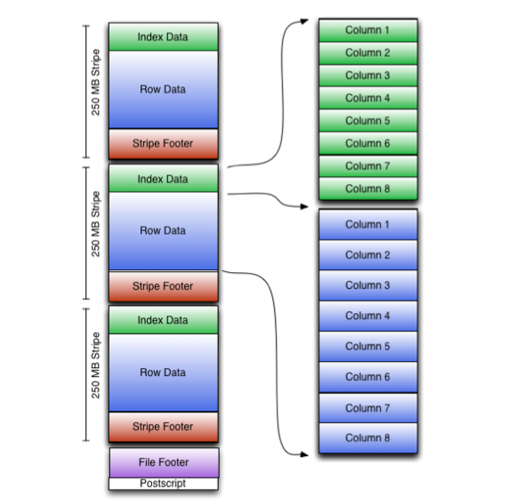
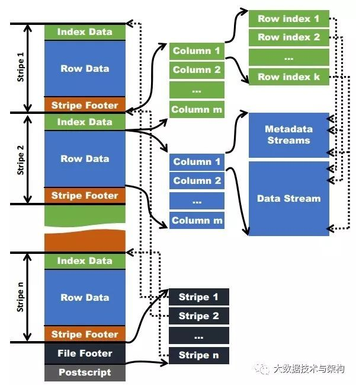
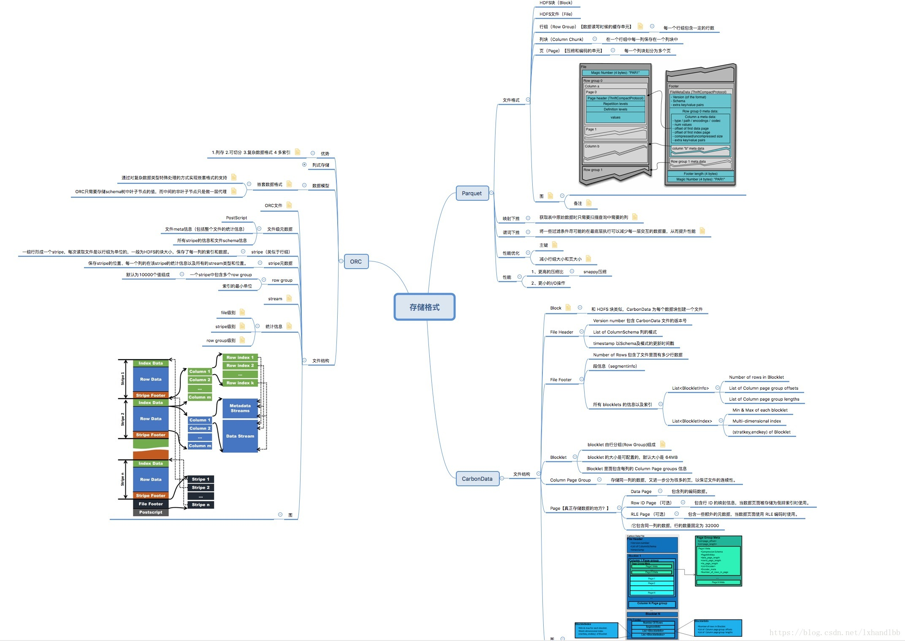

# ORC
https://www.huaweicloud.com/articles/76e423ad4ee18b909b7788c8d8004d1a.html
## Format



```
Stripes:  
    Index Data  
	Row Data  
	Stripe Footer:元数据，记录了index和data的的长度  
Footer:
	File Footer： 它包含了每一个stripe的长度和偏移量，该文件的schema信息(将schema树按照schema中的编号保存在数组中)、整个文件的统计信息以及每一个row group的行数。
	统计信息：每一个stripe中每一列的信息，主要统计成员数、最大值、最小值、是否有空值等
	Postscript: 文件元数据信息（压缩格式，Footer长度、版本信息等）
```

## 数据访问：
	读取ORC文件是从尾部开始的，第一次读取16KB的大小，尽可能的将Postscript和Footer数据都读入内存。
	文件的最后一个字节保存着PostScript的长度，它的长度不会超过256字节。
	PostScript中保存着整个文件的元数据信息，它包括文件的压缩格式、文件内部每一个压缩块的最大长度(每次分配内存的大小)、Footer长度，以及一些版本信息。

	在Postscript和Footer之间存储着整个文件的统计信息;
	这部分的统计信息包括每一个stripe中每一列的信息，主要统计成员数、最大值、最小值、是否有空值等。

	处理stripe时首先从File Footer中获取每一个stripe的其实位置和长度、每一个stripe的Footer数据(元数据，记录了index和data的的长度)，
	整个striper被分为index和data两部分，stripe内部是按照row group进行分块的(每一个row group中多少条记录在Stripe的Footer中存储)，
	row group内部按列存储。每一个row group由多个stream保存数据和索引信息。每一个stream的数据会根据该列的类型使用特定的压缩算法保存。在ORC中存在如下几种stream类型：
		PRESENT：每一个成员值在这个stream中保持一位(bit)用于标示该值是否为NULL，通过它可以只记录部位NULL的值
		DATA：该列的中属于当前stripe的成员值。
		LENGTH：每一个成员的长度，这个是针对string类型的列才有的。
		DICTIONARY_DATA：对string类型数据编码之后字典的内容。
		SECONDARY：存储Decimal、timestamp类型的小数或者纳秒数等。
		ROW_INDEX：保存stripe中每一个row group的统计信息和每一个row group起始位置信息。

	在初始化阶段获取全部的元数据之后，可以通过includes数组指定需要读取的列编号，它是一个boolean数组，如果不指定则读取全部的列，
	还可以通过传递SearchArgument参数指定过滤条件，
	根据元数据首先读取每一个stripe中的index信息，然后根据index中统计信息以及SearchArgument参数确定需要读取的row group编号，
	再根据includes数据决定需要从这些row group中读取的列，通过这两层的过滤需要读取的数据只是整个stripe多个小段的区间，然后ORC会尽可能合并多个离散的区间尽可能的减少I/O次数。
	然后再根据index中保存的下一个row group的位置信息调至该stripe中第一个需要读取的row group中。

	由于ORC中使用了更加精确的索引信息，使得在读取数据时可以指定从任意一Row Group开始读取，更细粒度的统计信息使得读取ORC文件跳过整个row group，
	ORC默认会对任何一块数据和索引信息使用ZLIB压缩，因此ORC文件占用的存储空间也更小，这点在后面的测试对比中也有所印证。

	在新版本的ORC中也加入了对Bloom Filter的支持，它可以进一步提升谓词下推的效率，在Hive 1.2.0版本以后也加入了对此的支持。

# Parquet
## Parquet Format


# all
