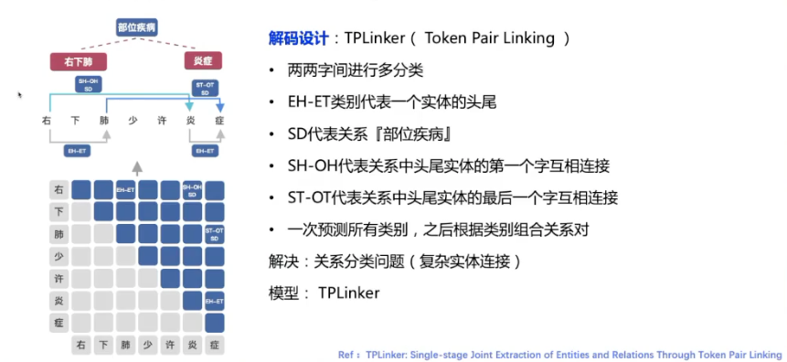

## 1. 词法分析

分词，并对每个词进行分类，包括：分词、词性标注、实体识别

Why做分词
 - 词是自然语言表意的基础单位
 - 词法分析是nlp基础且重要的任务：
   - 信息检索、信息抽取等应用的重要基础
   - 用于辅助其他nlp任务，如句法分析、问答对话、文本分类等

### 1.1. 应用
#### 1.1.1. 搜索
 - 词为表意的基本单位，单个字不具有具体意义
 - 整句难以完全匹配
 - 以词进行搜索是“准确”与“召回”的均衡

#### 1.1.2. 生成知识图谱

#### 1.1.3. 实体抽取


### 1.2. 技术发展
 - 基于词典
   - 字符串匹配：前向/后向最大匹配，IK分词(ES)
   	 优缺点：方法简单可控，速度快；难以解决歧义以及新词
   - 统计语言模型：N-Gram
     - 基于词典构建有向无环图
	 - 计算有向无环图最大概率路径
	 - 代表应用：jieba、ICTCLAS(NLPIR)
	 - 缺点：难以解决新词问题
 - 基于序列标注：
   - 采用BIO标签方式
     - 输入输出都是序列，并且一一对应
	 - 分类问题的一个推广，多分类问题
   - 统计方法：HMM、CRF等
   - 深度学习：LSTM+CRF(存在OOV问题)、FLAT、预训练+CRF等
 - 效果评出
   - 按照词的个数统计，非按照字
     - 准确率(Precision) = 预测准确的词个数/预测出来的个数
     - 召回率(Recall) = 预测准确的词个数/人工标注的词的个数
     - F1 = 2*P*R/(P+R)


## 2. 信息抽取
信息抽取应用
 - 医疗：抽取症状、药物名抽取等
 - 金融：贷款业务中提取资产证明中相关信息与申请信息对比
 - 法律：抽取案例中的信息，做成检索

### 2.1. 定义
**自动从无结构或半结构的的文本中抽取结构化信息的任务**

根据抽取结果是不是在原文中，任务可以分为：抽取式、生成式

常见信息抽取任务有三类：实体、关系、事件

信息抽取模型的关键要素：解码设计
  - 序列标注：单或多类别标注，常用**BIO**解码
  - Point：标注抽取结果的start和end
  - Token Pair: 对句子中的字两两之间标注类别

### 2.2. 实体抽取

从一段文本中抽取文本内容，并识别为预定义的类别

可以使用BIO简单解码

#### 2.2.1. 复杂实体抽取中的问题
  - 重叠嵌套
    ```
    左侧胸背部持续性疼痛 -> 症状：左侧胸背部持续性疼痛 部位：左侧胸背部
    ```
  - 不连续：一个实体由多个不连续片段组成
    ```
    前胸、北部包块 -> 症状：前胸包快、北部包块
    ```

### 2.3. 关系抽取
从文本中抽取一对实体和预定义的关系类型，得到包含语义信息的实体关系三元组

关系是有方向的，抽取的实体一般称作为头实体（Head Entity）和 尾实体（Tail Entity）

```
左下肺少许炎症 -> 左下肺-部位疾病-炎症
```

关系抽取分两步
 - 实体抽取
 - 关系分类

通常分多步抽取的模型方案叫做pipeline，只用一个模型抽取的方案叫Joint

#### 解码设计
 - **方案1**
   
   - BIO+关系标签：
     - [BIO] + [关系类别] + [头尾实体]
     - SD代表关系【部位疾病】
     - 1和2代表头实体和尾实体
     - 产出结果之后，通过设定规则生成关系
   - 解决：关系抽取问题（关系不能共用一个实体）
   - 模型：CRF条件随机场
   - 问题：
     - 关系重叠无法处理，一个实体属于多个关系
       ```
       左下肺少于验证，见结节 -> 左下肺-部位疾病-炎症  结节-病变部位-左下肺
       ```

 - **方案2**
   
   - BIO+关系标签+多分类
     - 一个字可以被标示为多个类别
     - 有多个B类别，代表不同实体关系
     - 一个I类别表示单词范围
     - SD、CH
     - 1，2代表头实体和尾实体
   - 解决：实体关系抽取，重叠关系问题，（实体对组合问题）
   - 模型输出：Sigmoid独立多分类
   - 也适用于事件抽取

 - **方案3**
   
   - 尾实体预测方式
     - 把头实体的词向量平均
     - 跟原输入的每个字相加作为尾实体预测模型的输入
     - 这样就可以表示头实体与各个字的关系

 - **方案4** 当前效果最好的模型
   
   - 两两字间进行多分类
   - 有点类似attention

 - 其他问题
   - 远监督噪音
   - 当前一般是一句话，文档级抽取怎么办
   - 开放域抽取：构建知识图谱，SPO

### 2.4. 事件抽取

从一段文本中，抽取出事件触发词和事件要素，组合为相应的结构化信息

除了事件，实际应用中信息抽取的结果可能更复杂，但都可以拆成关系抽取
