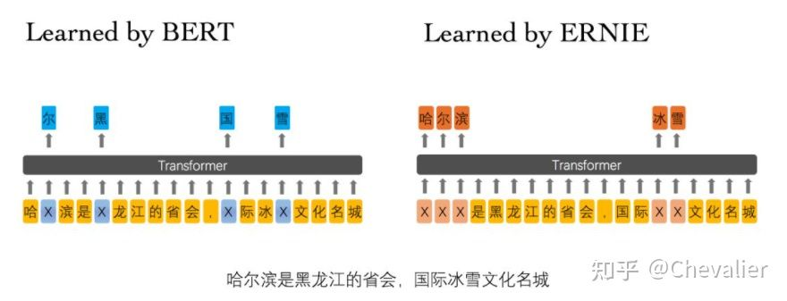
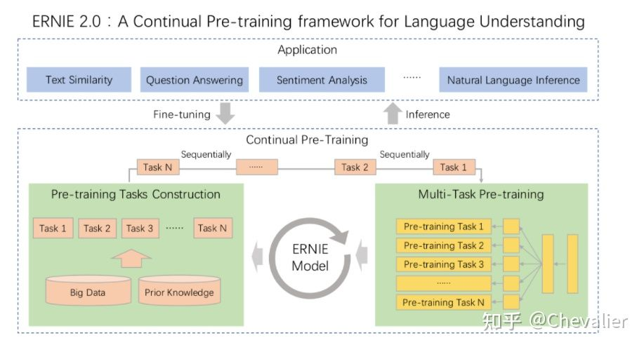
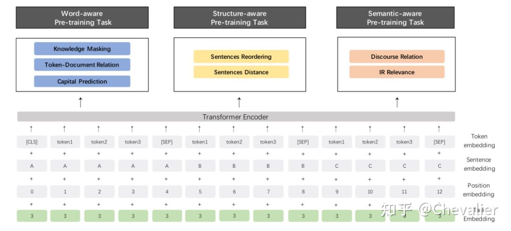

## 1. BERT

bert主要通过预训练两个任务来分别学习词的表示和捕捉句子之间的关系：Masked Language Model和Next Sentence Prediction。

### 1.1. Masked Language Model 

随机mask文本中15%的token，然后同时利用左侧和右侧的词语（也就是被mask掉的token 的上下文）来预测被mask掉的token。

虽然这种方法能利用上下文信息来预测token，但是也有两个缺点。首先pretrain阶段和finetune阶段不一致，finetune阶段是没有[mask]标记的。

为了缓解这种情况，作者并不总是用[MASK]来替换被选中的单词。作者针对随机选择的15%的token，做了如下的mask策略：
 - 80%的时间用[mask]代替
 - 10%的时间用随机的token代替
 - 10%的时间不变化

这样做的好处是transformer编码器不知道哪些单词是要预测的，或者哪些单词被随机替换了，因此它被迫学习每一个input token的上下文表示，而不是只学习被mask掉的token的表示。此外，只有1.5%的token被随机的token代替，这似乎并不损害模型的语言理解能力（另外一种解释有点意思：被随机的token代替使得模型能学习到一定的纠错能力）。

另外一个缺点是与标准的语言模型训练相比，Masked LM在每个batch中只预测15%的token，意味着模型需要迭代更多的预训练步数才能收敛。但是这与性能的大幅提升相比根本不值一提。

###  1.2. Next Sentence Prediction

很多下游任务如QA和NLI都是基于理解两个句子之间的关系来解决的，但是没有通过语言建模来直接捕捉这种关系。因此，为了训练一个可以捕捉句子之间关系的模型，作者进行了预训练NSP的任务。具体来说，在选择句子A和B的时候，50%的时间选择A的下一句作为B，50%的时间随机选择另外一个句子作为B。从实验结果来看，这个预训练任务对QA和NLI非常有效。

## 2. BERT_WWM

Whole Word Masking (wwm)，暂翻译为全词Mask或整词Mask，是谷歌在2019年5月31日发布的一项BERT的升级版本，主要更改了原预训练阶段的训练样本生成策略。 简单来说，原有基于WordPiece的分词方式会把一个完整的词切分成若干个子词，在生成训练样本时，这些被分开的子词会随机被mask。 在全词Mask中，如果一个完整的词的部分WordPiece子词被mask，则同属该词的其他部分也会被mask，即全词Mask。这会显示地强迫模型在MLM任务中去恢复整个单词，而不仅仅是WordPiece子词，显然这更具有挑战性。

需要注意的是，这里的mask指的是广义的mask（替换成[MASK]；保持原词汇；随机替换成另外一个词），并非只局限于单词替换成[MASK]标签的情况。

## BERT_WWM_ext

BERT_WWM的升级版，主要有两个改进：增加了训练数据和训练步数

## ERNIE

ERNIE 分为 1.0 版和 2.0 版，其中  **ERNIE 1.0是通过建模海量数据中的词、实体及实体关系，学习真实世界的语义知识** 。相较于BERT学习原始语言信号，ERNIE 1.0 可以直接对先验语义知识单元进行建模，增强了模型语义表示能力。例如对于下面的例句：“哈尔滨是黑龙江的省会，国际冰雪文化名城”

BERT在预训练过程中使用的数据仅是对单个字符进行屏蔽，例如上图所示，训练Bert通过“哈”与“滨”的局部共现判断出“尔”字，但是模型其实并没有学习到与“哈尔滨”相关的知识，即只是学习到“哈尔滨”这个词，但是并不知道“哈尔滨”所代表的含义；而ERNIE在预训练时使用的数据是对整个词进行屏蔽，从而学习词与实体的表达，例如屏蔽“哈尔滨”与“冰雪”这样的词，使模型能够建模出“哈尔滨”与“黑龙江”的关系，学到“哈尔滨”是“黑龙江”的省会以及“哈尔滨”是个冰雪城市这样的含义。

训练数据方面，除百科类、资讯类中文语料外，ERNIE 1.0 还引入了论坛对话类数据，利用对话语言模式（DLM, Dialogue Language Model）建模Query-Response对话结构，将对话Pair对作为输入，引入Dialogue Embedding标识对话的角色，利用对话响应丢失（DRS, Dialogue Response Loss）学习对话的隐式关系，进一步提升模型的语义表示能力。

因为 ERNIE 1.0 对实体级知识的学习，使得它在语言推断任务上的效果更胜一筹。ERNIE 1.0 在中文任务上全面超过了 BERT 中文模型，包括分类、语义相似度、命名实体识别、问答匹配等任务，平均带来 1～2 个百分点的提升。

我们可以发现 ERNIE 1.0 与 BERT 相比只是学习任务 MLM 作了一些改进就可以取得不错的效果，那么如果使用更多较好的学习任务来训练模型，那是不是会取得更好的效果呢？因此 ERNIE 2.0 应运而生。 **ERNIE 2.0 是基于持续学习的语义理解预训练框架，使用多任务学习增量式构建预训练任务：先训练任务1，保存模型，然后加载刚保存的模型，再同时训练任务1和任务2，依次类推，到最后同时训练所有任务** 。如下图所示，在ERNIE 2.0中，大量的自然语言处理的语料可以被设计成各种类型的自然语言处理任务（Task），这些新构建的预训练类型任务（Pre-training Task）可以无缝的加入图中右侧的训练框架，从而持续让ERNIE 2.0模型进行语义理解学习，不断的提升模型效果。

ERNIE 2.0 的预训练包括了三大类学习任务，分别是：

 - 词法层任务：学会对句子中的词汇进行预测。
 - 语法层任务：学会将多个句子结构重建，重新排序。
 - 语义层任务：学会判断句子之间的逻辑关系，例如因果关系、转折关系、并列关系等。

通过这些新增的语义任务，ERNIE 2.0语义理解预训练模型从训练数据中获取了词法、句法、语义等多个维度的自然语言信息，极大地增强了通用语义表示能力。ERNIE 2.0模型在英语任务上几乎全面优于BERT和XLNet，在7个GLUE任务上取得了最好的结果；中文任务上，ERNIE 2.0模型在所有9个中文NLP任务上全面优于BERT。

## Roberta

roberta是一个bert改进版的模型，在bert的基础上提出了一系列策略来调优：

 - 更大批次、更多数据来训练模型
 - 去除NSP任务
 - 在更长的序列上训练
 - 动态masking
 - a larger byte-level BPE

### 静态vs动态masking

静态masking：BERT原来的masking是在数据预处理时进行的，这会导致每个样本在每一次迭代过程中的masking是一样的，不会变化。

改进的静态masking：为了避免每个样本在每一次迭代过程中相同的masking，作者对训练数据复制了10遍然后进行masking，在40个epoch训练过程中一个样本有10种不同的masking方式，也就是说，每一种mask对应的数据训练了4个epoch。

动态masking：与静态masking在数据预处理进行masking不同，动态masking是在每次向模型输入序列时进行的。当以更多步数或数据进行预训练时非常关键。

### 去除NSP

原来的BERT模型中除了MLM任务之外，还进行了NSP任务，识别两个句子之间的关系。有一部分工作经过实验发现去除NSP任务后模型性能有所提升，也有一些工作验证了NSP任务的必要性。

### byte-level BPE

## XLNet
XLNet是一种通用的自回归预训练方法，该方法利用了AR语言建模和AE的优点，同时避免了它们的局限性。XLNet主要从三个方面进行优化：

 - 提出了新的目标函数：排列语言建模（Permutation Language Modeling，PLM）
 - 双流自注意力机制
 - 引入Transformer-XL
